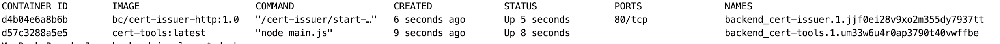
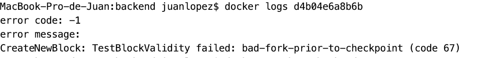

## How to run

### Build cert-issuer image
`sudo docker build . -t bc/cert-issuer-http:1.0 -f cert-issuer/Dockerfile.web --build-arg NETWORK=ropsten --build-arg SERVER=localhost`

### Build cert-tools server image
`docker build . -t cert-tools -f cert-tools/Dockerfile`

### Deploy Stack
`docker stack deploy --compose-file docker-compose.yml --prune backend`

## Take a look 

### Ver los últimos 2 contenedores ejecutados
`docker ps -n 2`

### Ver los logs de un contenedor

`docker logs <container id>`



Ejemplo con bc/cert-issuer-http:1.0 de la imagen

`docker logs d4b04e6a8b6b`

Ejemplo de log con error

### Entrar al contenedor

Ejemplo con bc/cert-issuer-http:1.0 de la imagen

`docker exec -it d4b04e6a8b6b /bin/bash`

### Salir al contenedor

`exit`

## Volver a construir todo

### Destruir el stack
`docker stack rm backend`

### build 

```
sudo docker build . -t bc/cert-issuer-http:1.0 -f cert-issuer/Dockerfile.web --build-arg NETWORK=ropsten --build-arg SERVER=localhost
docker build . -t cert-tools -f cert-tools/Dockerfile
```
Nota: Basta con hacer build de la imagen que se modifico

### Deploy

`docker stack deploy --compose-file docker-compose.yml --prune backend`